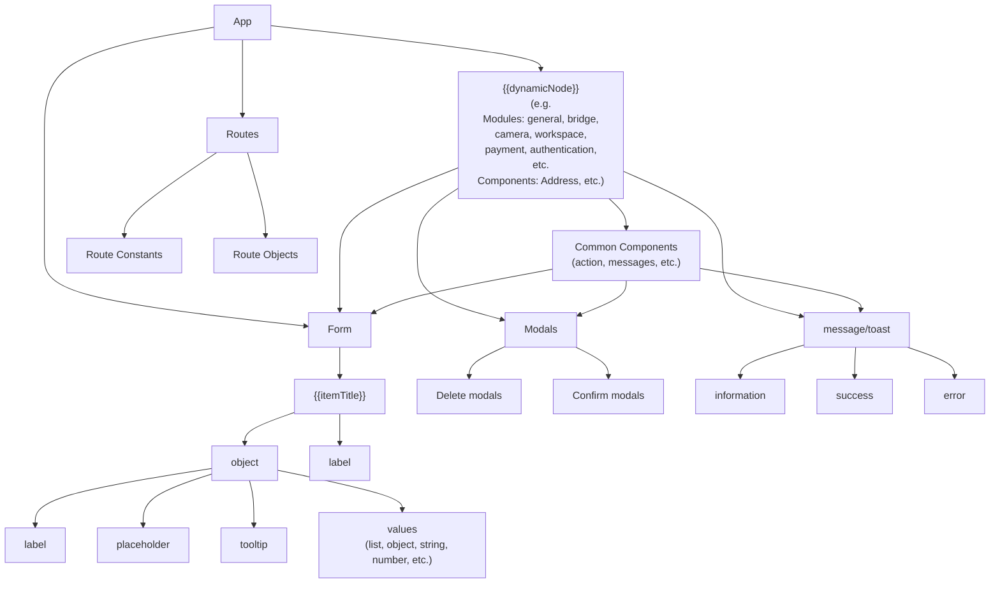

```mermaid
flowchart TB
    app[App]
    app --> node
    app --> form
    app --> routes

    node["{{dynamicNode}}
     (e.g.
     Modules: general, bridge,
     camera, workspace,
     payment, authentication,
     etc.
     Components: Address, etc.)"]
    node --> common
    node --> modal
    node --> form
    node --> message["message/toast"]

    common["Common Components
     (action, messages, etc.)"]
    common --> form
    common --> modal


    form[Form] --> formItem["{{itemTitle}}"]
    formItem --> formObject[object]
    formItem --> label[label]
    formObject --> formLabel[label]
    formObject --> formPlaceholder[placeholder]
    formObject --> formTooltip[tooltip]
    formObject --> formValues["values
    (list, object, string, number, etc.)"]

    modal["Modals"]
    modal --> modalDelete["Delete modals"]
    modal --> modalConfirm["Confirm modals"]

    routes["Routes"]
    routes --> routeConst["Route Constants"]
    routes --> routeObjects["Route Objects"]

    common --> message

    message --> messageInfo[information]
    message --> messageSuccess[success]
    message --> messageError[error]
```
